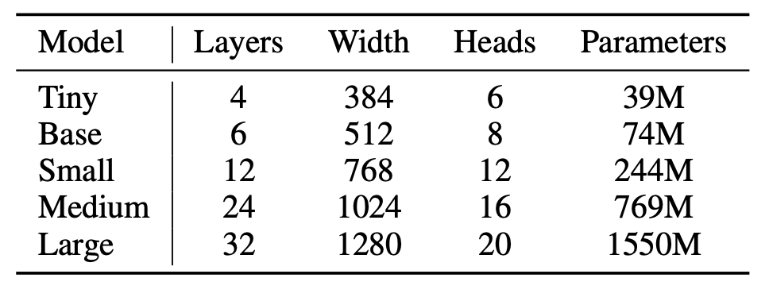
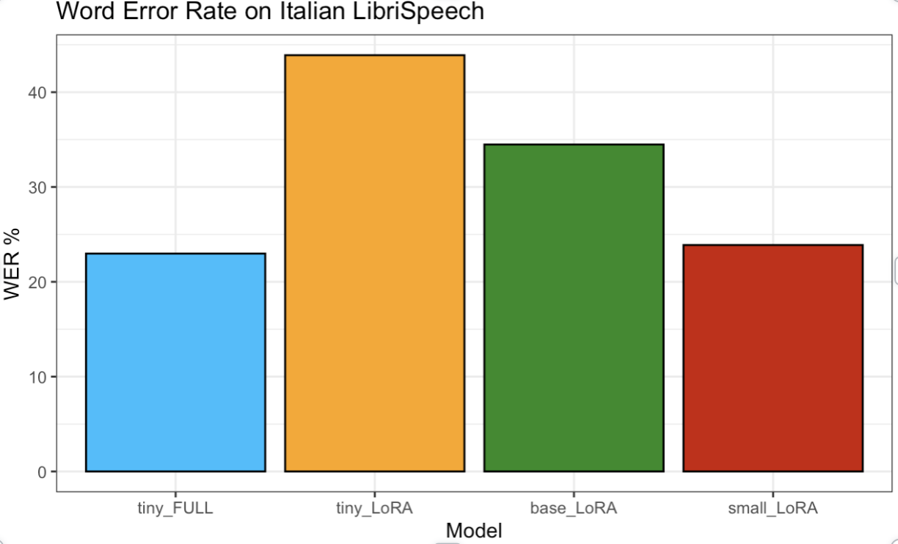

## Introduction 
The first idea for the project was to recreate the architecture of OpenAI Wisper model from the paper <a href="https://cdn.openai.com/papers/whisper.pdf" target="_blank">Robust Speech Recognition via Large-Scale Weak Supervision<a> and train it from scratch on a the english Librispeech dataset to evaluate its performance. Something went wrong so we decided to change a little bit the project. Everything about this part can be found in the [from_scratch](from_scratch) directory.
After our initial attempt, we decided to take a different approach. Instead of training from scratch, we opted to fine-tune the English-only Whisper model on Italian to evaluate its performance on a new language. Everything related to this can be found in the [finetune](finetune) directory.


## Dependencies
```
pip install -r requirements.txt
```

## Fine-Tuning
We decided to fine-tune the first three english models (Tiny, Base, Small) proposed by the authors of the paper using LoRA(Low-Rank Adaptation) and also to fully fine-tune the smallest one to see the difference between the 2 approaches. 



The train data consists of the Italian section of the Multilingual LibriSpeech (MLS) dataset that consists of more than 250 hours of audio and was performed on a NVIDIA RTX 4090.
Word Error Rate was used as evaluation metric.


## Results

From the first plot we can notice that bigger models lead to better results and also that fully fine-tuned tiny model is comparablewith the LoRA fine-tuning of the small model where the number of trainable parameter was much smaller.




